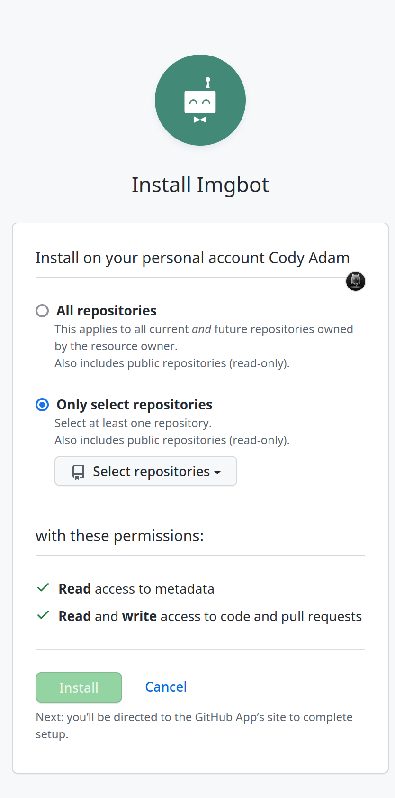
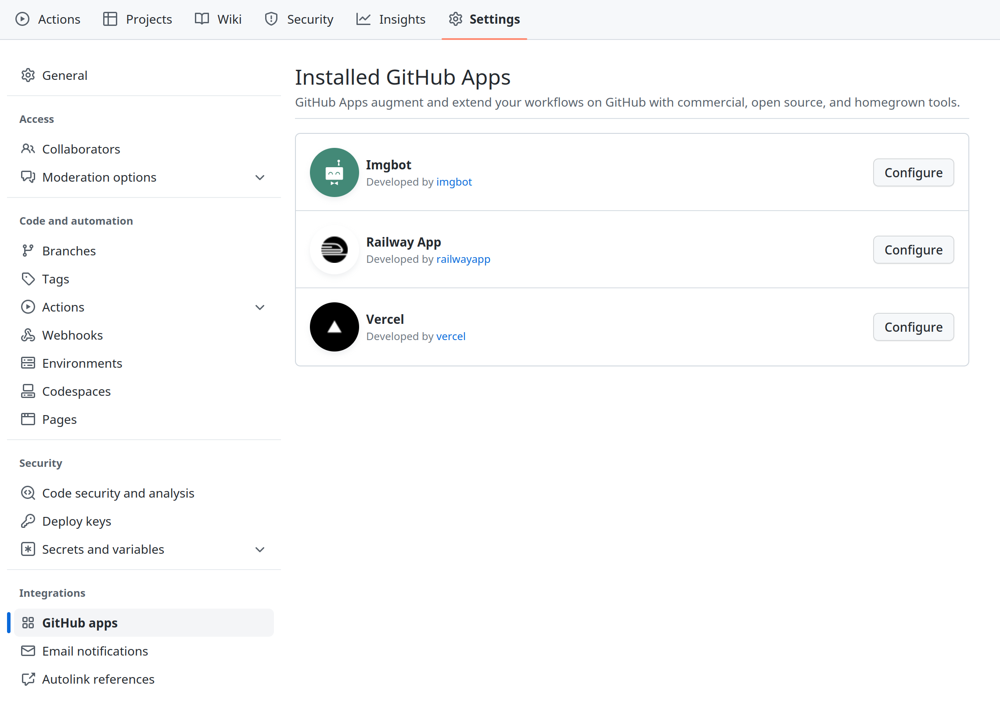
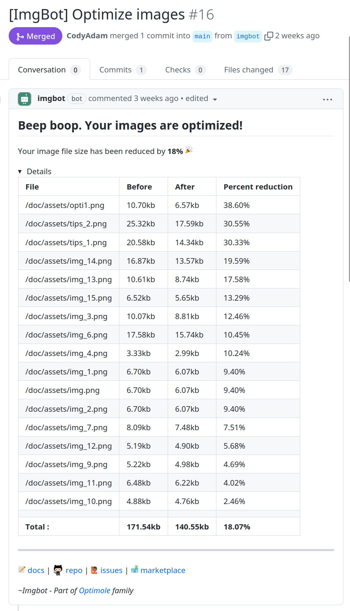

<p align="center">
    
</p>

<h1 align="center">Imgbot</h1>

---

## 🤔 What is ImgBot?

It's a helpful **automation tool** that **reduces the file sizes of your images** while maintaining their quality, ultimately saving you time. 

Once you have installed ImgBot, you will receive a pull request containing your optimized images. **Merging the pull request is all that is required**. 

As you continue working on your project, ImgBot will remain active, continuously optimizing your images. 

ImgBot utilizes **lossless compression by default**, ensuring that you only gain from using it. However, if you desire to save additional space, you can modify ImgBot to use lossy compression.


# 📦 Installation

This bot utilizes the [GitHub App](https://github.com/marketplace) model. You can install it on your organization or a single repository.


You will then need to select the repositories you want to install ImgBot on.



That's it! ImgBot is now installed on your repository.
You can know if ImgBot is installed on your repository by looking at **Settings > Integrations > GitHub Apps**.




# ⚙️ Configuration

You can configure ImgBot by creating a `.imgbotconfig` file in the root of your repository as a JSON file.

Here are the available options (all are optional):

| Name                  | Description                                             | Default | Type       |
| --------------------- | ------------------------------------------------------- | ------- | ---------- |
| schedule              | The frequency at which ImgBot will run.                 | `daily` | `daily     | weekly | monthly` |
| ignoredFiles          | A list of files to ignore.                              | `[]`    | `string[]` |
| aggressiveCompression | Use lossy compression.                                  | `false` | `boolean`  |
| compressWiki          | Compress images in the wiki of the repo.                | `false` | `boolean`  |
| minKBReduced          | Delay new prs until size reduction meets this threshold | `10`    | `number`   |
| prTitle               | The title of the pull request                           | ...     | `string`   |
| prBody                | The body of the pull request                            | ...     | `string`   |


Here is an example of a configuration file:

```json
{
    "schedule": "daily",  // daily|weekly|monthly
    "ignoredFiles": [
        "*.jpg",                   // ignore by extension
        "image1.png",              // ignore by filename
        "public/special_images/*", // ignore by folderpath
    ],
    "aggressiveCompression": "true", // true|false
    "compressWiki": "true", // true|false
    "minKBReduced": 500, // delay new prs until size reduction meets this threshold (default to 10)
    "prTitle" : "Your own pr title",        
    "prBody" : " Text before optimization ratio {optimization_ratio} Text after optimization ratio 
                 Text before optimization details {optimization_details} Text after optimization details",
}
```

# 📝 Usage

Once ImgBot is installed, it will automatically optimize your images through a pull request. 

### Lossless Compression

Here is an example of a pull request created by ImgBot:



This example used lossless compression, which is the default setting. If you want to use lossy compression, you can modify the configuration file. The total savings is currently 18.07%.

### Aggressive Compression

If you want to save even more space, you can modify the configuration file to use lossy compression.

With the following configuration file:

```json
{
    "aggressiveCompression": "true"
}
```

Here is the result:


